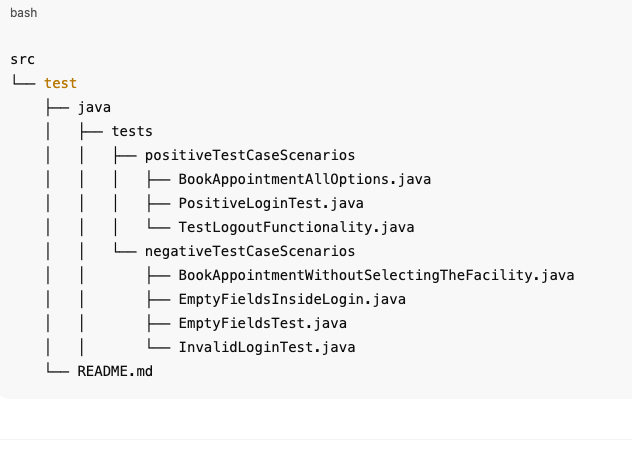

#📄 Selenium Test Automation Suite - Cura Healthcare

## 📂 Project Structure

| Test Class                  | Description                                                         |
| --------------------------- | ------------------------------------------------------------------- |
| `BookAppointmentAllOptions` | Books an appointment successfully with all fields filled correctly. |
| `PositiveLoginTest`         | Verifies login with valid credentials and booking an appointment.   |
| `TestLogoutFunctionality`   | Verifies logout functionality after booking an appointment.         |

| Test Class                                   | Description                                                   |
| -------------------------------------------- | ------------------------------------------------------------- |
| `BookAppointmentWithoutSelectingTheFacility` | Attempts to book an appointment without selecting a facility. |
| `EmptyFieldsInsideLogin`                     | Attempts login with a username but without a password.        |
| `EmptyFieldsTest`                            | Attempts login without entering any credentials.              |
| `InvalidLoginTest`                           | Attempts login with completely invalid credentials.           |

## ⚙️ Prerequisites
Java 8 or higher

Selenium WebDriver

TestNG

Firefox Browser

geckodriver in system PATH

## ✅ Test Pass Criteria
Test Type	Expected Result
Positive Tests	The test should pass if the application behaves as expected and allows successful operations.
Negative Tests	The test should pass if the application properly rejects invalid actions, shows correct error messages, and prevents incorrect workflows.

✔️ Important: A test passes if the actual behavior matches the expected behavior, even in negative scenarios.

## 🔍 Notes
Implicit waits are used in all tests to handle element loading delays.

Tests can be improved by using Page Object Model (POM) for better maintainability.

All assertions use TestNG for verification.